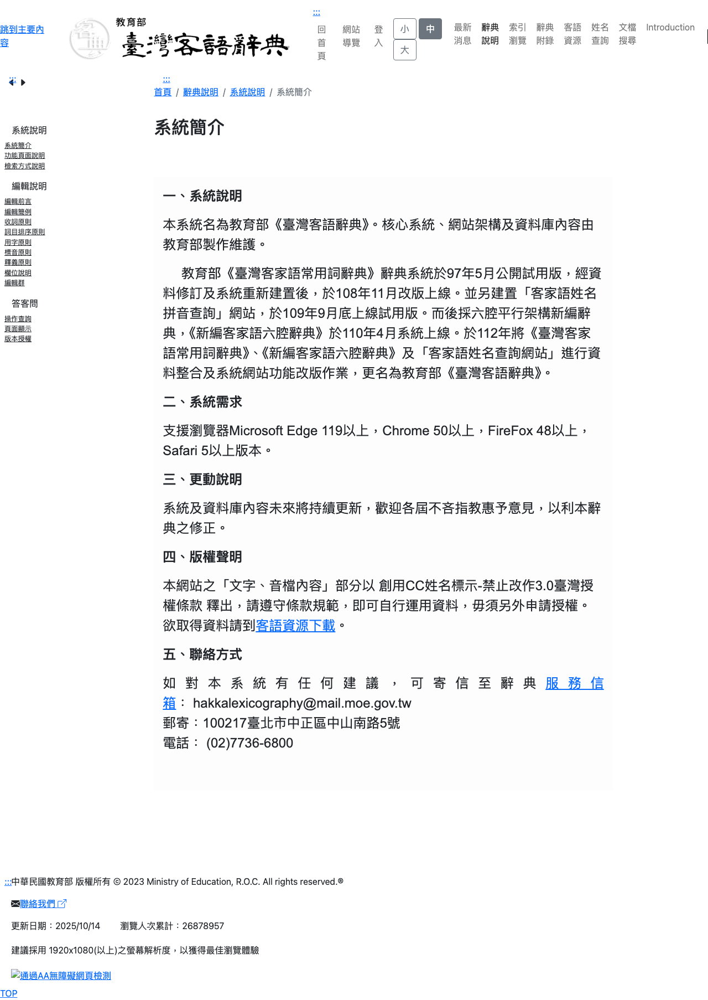

# HakkaDictMoeDataMirror

Data mirror for HakkaDict MOE (教育部《臺灣客語辭典》). This repository provides direct access to extracted and merged dictionary data for **四縣腔 (Si-yen)** and **南四縣腔 (Nam-si-yen)** dialects.

The data is merged into single CSV and JSON files for easier programmatic use, with a `Dialect` column indicating the source.

> The upstream ODS files for the other four dialects — **海陸腔 (Hai-luk)**, **大埔腔 (Tai-phu)**, **饒平腔 (Ngiau-phin)**, and **詔安腔 (Ciau-on)** — are mirrored as-is under `public/<version>/tangloo/` for completeness, but are **not** included in the merged CSV/JSON. PFS conversion is currently exercised only for Si-yen / Nam-si-yen.

## 版權聲明 (Copyright Notice)

* **Source**: [教育部《臺灣客語辭典》](https://hakkadict.moe.edu.tw/)
* **Copyright**: [系統簡介 - 版權聲明](https://hakkadict.moe.edu.tw/directions/%E7%B3%BB%E7%B5%B1%E8%AA%AA%E6%98%8E/%E7%B3%BB%E7%B5%B1%E7%B0%A1%E4%BB%8B/)
* **License**: [創用CC姓名標示-禁止改作 3.0 臺灣 授權條款](https://creativecommons.org/licenses/by-nd/3.0/tw/) (CC BY-ND 3.0 TW)

[](https://hakkadict.moe.edu.tw/directions/%E7%B3%BB%E7%B5%B1%E8%AA%AA%E6%98%8E/%E7%B3%BB%E7%B5%B1%E7%B0%A1%E4%BB%8B/)

## LATEST VERSION

* **Version ID**: 20260525-2020
* **Last Updated**: 2026-05-25
* **Entries**: 35,901 (Si-yen 17,772 + Nam-si-yen 18,129)
* **Categories**: 28 (11,037 entries tagged, 14,304 total assignments)

| Category | Count | | Category | Count |
| --- | ---: | --- | --- | ---: |
| 事物情狀 | 1,326 | 慣用語 | 493 |
| 人物品評 | 986 | 時間節令 | 466 |
| 人際互動 | 952 | 天文地理 | 424 |
| 宗教民俗 | 835 | 建築住居 | 399 |
| 飲食 | 825 | 動物 | 386 |
| 稱謂身分 | 783 | 空間方位 | 316 |
| 財經法政 | 752 | 衣著裝扮 | 296 |
| 疾病醫療 | 718 | 人體器官 | 269 |
| 表情動作 | 638 | 生活狀態 | 262 |
| 器物用品 | 572 | 交通通訊 | 184 |
| 產業勞動 | 535 | 量詞 | 169 |
| 教育文化 | 535 | 運動休閒 | 124 |
| 思維心態 | 523 | 閩南語借詞 | 20 |
| 植物 | 508 | 日語借詞 | 8 |

**Syllable distribution** (by `音讀`):

| Syllables | Count | % | | Syllables | Count | % |
| ---: | ---: | ---: | --- | ---: | ---: | ---: |
| 1 | 7,899 | 22.0% | 6 | 126 | 0.4% |
| 2 | 19,120 | 53.3% | 7 | 208 | 0.6% |
| 3 | 5,192 | 14.5% | 8 | 178 | 0.5% |
| 4 | 2,550 | 7.1% | 9 | 72 | 0.2% |
| 5 | 177 | 0.5% | 10+ | 376 | 1.0% |

You can check [manifest.json](public/manifest.json) for the latest version information programmatically.

## ACCESSING FILES

The files are organized by version. The latest files are in `public/20260525-2020/`.

> **Note:** Only the latest `public/<version>/` directory is checked into the working tree. Each new build prunes the previous version — older snapshots are still recoverable from git history (or from the upstream MOE site).

### 1. TEXT DATA (MERGED)

* **HakkaDictMoeData.csv** (Merged Data CSV): [Link](https://thoivanhakfa.github.io/HakkaDictMoeDataMirror/public/20260525-2020/bunji/HakkaDictMoeData.csv)
* **HakkaDictMoeData.json** (Merged Data JSON): [Link](https://thoivanhakfa.github.io/HakkaDictMoeDataMirror/public/20260525-2020/bunji/HakkaDictMoeData.json)

#### 音讀 Columns

The phonetic reading of each entry follows the [KPPY (教育部客家語拼音方案)](https://language.moe.gov.tw/001/Upload/files/site_content/M0001/mina/D/D002.pdf) (Kàu-pō͘ Phin-yîm, 2008/2012). Four reading columns are provided — the original KPPY forms plus [PFS (Pha̍k-fa-sṳ)](https://en.wikipedia.org/wiki/Pha%CC%8Dk-fa-s%E1%B9%B3) equivalents:

| Column | Form | Example |
| --- | --- | --- |
| `音讀` | KPPY 數字式 — Chao pitch values appended to each syllable | `bau24 san24 sed2 hoi31` |
| `音讀（符號）` | KPPY 符號式 — diacritic tone marks per syllable (matches the dictionary website's display) | `bauˊ sanˊ sed hoiˋ` |
| `PFS` | PFS Unicode — diacritics on nucleus; hyphens for ≤4 syllables | `pâu-sân-set-hói` |
| `PFS輸入式` | PFS Input — tone digit 1–6; hyphens for ≤4 syllables | `pau1-san1-set6-hoi3` |

`音讀（符號）` is derived from `音讀` at build time via `reading_digit_to_symbol()` in `script/python/build_mirror.py`. The PFS columns are generated by [KonvertToPFS](https://github.com/Phakfasu/KonvertToPFS) (included as a Git submodule at `lib/KonvertToPFS`), called via `script/js/convert_to_pfs.js`.

##### Variant readings

Entries may carry alternative pronunciations alongside the primary reading. All four reading columns use the same programmatic format: segments are separated by `/`, and each non-primary segment is prefixed with a parenthesized tag identifying the variant type. Hyphenation in PFS columns is decided per segment.

| Tag | Meaning |
| --- | --- |
| `(又讀)` | Also-read variant |
| `(俗音)` | Colloquial/vulgar reading |
| `(又俗音)` | Also-read colloquial variant |
| `(文)` / `(白)` | Literary (文讀) / colloquial (白讀) reading pair |
| `(特)` / `(特殊音)` | Special / particular reading |
| `(合音)` / `(合音讀)` | Fused (assimilated) reading |

Tags may carry a trailing ordinal digit when the upstream data numbers the variants — e.g. `(文1)`, `(又讀2)`. Examples:

| `音讀` | `PFS` |
| --- | --- |
| `fu55 vun11/(又俗音)fu24 vun11/(又俗音)pu24 vun11` | `fu-vùn/(又俗音)fû-vùn/(又俗音)phû-vùn` |
| `(文1)qien11 sii55/(白)qien11 se55` | `(文1)chhièn-sṳ/(白)chhièn-se` |
| `loi11 hi55/(合音)li24/(合音)loi24` | `lòi-hi/(合音)lî/(合音)lôi` |
| `(特)lo55 fu31` | `(特)lo-fú` |

##### Si-yen / Nam-si-yen tone table (長老教會 PFS tone numbers)

Tones below are numbered per the traditional 長老教會 PFS convention — `1`–`6` over the six Si-yen tones.

| PFS № | KPPY 調號 | KPPY 調值 | KPPY 符號 | KPPY 調型 | IPA tone letter | PFS diacritic | Coda |
| --- | --- | --- | --- | --- | --- | --- | --- |
| 1 | 1 | 24  | `ˊ`    | `ˊ`    | [˨˦]   | `◌̂` |   |
| 2 | 5 | 11  | `ˇ`    | `ˇ`    | [˩˩]   | `◌̀` |   |
| 3 | 2 | 31  | `ˋ`    | `ˋ`    | [˧˩]   | `◌́` |   |
| 4 | 3 | 55  | (none) | (none) | [˥˥]   | (none) |   |
| 5 | 8 | 5   | (none) | (none) | [˥]    | `◌̍` | `-b/-d/-g` ↔ `-p/-t/-k` |
| 6 | 4 | 2   | `ˋ`    | `ˋ`   | [˨]    | (none) | `-b/-d/-g` ↔ `-p/-t/-k` |
| — | — | 33  | `+`    | `+`    | [˧]    | — | tone-1 變調 surface form, not its own slot |

Tones with stop codas (5, 6) are short (single IPA tone letter vs. doubled for open syllables). 陰入 (pitch 2, low checked) carries ˋ, pairing with 上聲; 陽入 (pitch 5, high checked) is unmarked, pairing with 去聲 — distinguished from their open-syllable counterparts by the stop coda. Mappings for the other KPPY dialects (海陸 / 大埔 / 饒平 / 詔安) live in `TONE_DIGIT_TO_SYMBOL` in `script/python/build_mirror.py`; only Si-yen / Nam-si-yen rows appear in the merged CSV/JSON (the raw ODS files for the other four dialects are mirrored unchanged under `tangloo/`).

###### KPPY Tone Display Modes

The official MOE dictionary interface, as well as the underlying data in the `詞目索引` column, categorizes tones using three distinct KPPY display modes (顯示模式) combined into a `(調號/調型/調值)` format, for example: `陰平(1/ˊ/24)` or `陰入(4/ˋ/2)`. These three modes correspond directly to the table columns above:

1. **KPPY 調號 (Tone Number)**: Follows the conventional 8-tone Middle-Chinese scheme (平、上、去、入), merging unused slots in Si-yen.
2. **KPPY 調型 (Tone Shape / 符號式)**: The diacritic mark used. This is extracted into the `音讀（符號）` column in this dataset.
3. **KPPY 調值 (Tone Pitch Value / 數字式)**: The 2-digit Chao pitch contour. This is extracted into the base `音讀` column in this dataset.

Cross-walk: KPPY 調號 `1` = PFS `1`; the rest diverge because KPPY 調號 follows the 8-tone frame while PFS numbers the six tones sequentially — KPPY 調號 `2` = PFS `3`, KPPY 調號 `3` = PFS `4`, KPPY 調號 `4` = PFS `6`, KPPY 調號 `5` = PFS `2`, KPPY 調號 `8` = PFS `5`.

Stop-coda syllables write the symbol after the coda (e.g. `ngiab2 → ngiabˋ`, `vog5 → vog`). Nam-si-yen shares the Si-yen tone inventory. Only `四縣腔` / `南四縣腔` rows appear in the merged CSV/JSON; the other four dialects (`海陸腔` / `大埔腔` / `饒平腔` / `詔安腔`) are mirrored as raw ODS under `tangloo/`, and their tone-symbol mappings are kept in the build script for completeness.

##### KPPY ↔ Pha̍k-fa-sṳ (PFS) correspondence

The dataset uses KPPY. For consumers wanting to convert to **[Pha̍k-fa-sṳ](https://en.wikipedia.org/wiki/Pha%CC%8Dk-fa-s%E1%B9%B3)** (白話字, the historical missionary Roman Orthography for Hakfa), the correspondences are:

**Initials** — PFS uses voiceless letters with `h`-aspiration; KPPY uses voiced letters for unaspirated stops.

| KPPY | PFS | IPA | Notes |
| --- | --- | --- | --- |
| `b`  | `p`   | [p]   | |
| `p`  | `ph`  | [pʰ]  | |
| `m`  | `m`   | [m]   | |
| `f`  | `f`   | [f]   | |
| `v`  | `v`   | [ʋ]   | |
| `bb` | —     | [b]   | 詔安 / 南投國姓 / parts of southern Hakfa — not represented in standard PFS |
| `d`  | `t`   | [t]   | |
| `t`  | `th`  | [tʰ]  | |
| `n`  | `n`   | [n]   | |
| `l`  | `l`   | [l]   | |
| `g`  | `k`   | [k]   | |
| `k`  | `kh`  | [kʰ]  | |
| `ng` | `ng`  | [ŋ]   | (palatalizes to [ɲ] before front vowels in PFS notation `ng(i)`) |
| `h`  | `h`   | [h]   | |
| `z`  | `ch`  | [ts]  | |
| `c`  | `chh` | [tsʰ] | |
| `s`  | `s`   | [s]   | |
| `j`  | `chi` | [tɕ]  | Si-yen palatal series, only before `i` |
| `q`  | `chhi`| [tɕʰ] | Si-yen, before `i` |
| `x`  | `si`  | [ɕ]   | Si-yen, before `i` |
| `zh` `ch` `sh` `rh` | — | [tʃ tʃʰ ʃ ʒ] (flat tongue) | 大埔 / 海陸 / 饒平 / 詔安 only |

**Vowels & finals**

| KPPY | PFS | IPA | Notes |
| --- | --- | --- | --- |
| `a`  | `a`  | [a] | |
| `e`  | `e`  | [e] | |
| `i`  | `i`  | [i] | |
| `o`  | `o`  | [o] | |
| `u`  | `u`  | [u] | |
| `ii` | `ṳ`  | [ɨ] | close central unrounded |
| `er` | `er` | [ɤ] | primarily 海陸 / 饒平; rare in Si-yen |
| `ee` | —    | [ɛ] | 詔安 only — no standard PFS letter |
| `oo` | —    | [ɔ] | 詔安 only |
| `nn` | —    | [◌̃] | 詔安-only nasalization marker |

**Codas** — nasals identical (`-m -n -ng`); 入聲 stops are written voiceless in PFS:

| KPPY | PFS | IPA |
| --- | --- | --- |
| `-m` | `-m` | [m]  |
| `-n` | `-n` | [n]  |
| `-ng`| `-ng`| [ŋ]  |
| `-b` | `-p` | [p̚] |
| `-d` | `-t` | [t̚] |
| `-g` | `-k` | [k̚] |

**Spelling adjustments** — two orthographic rules reshape syllables on the PFS side. Both apply uniformly across both PFS columns (Unicode and Input); consonant-initial syllables that begin with `ki-`, `liong`, `kua-`, etc. are unaffected by the first rule but still subject to the u-onglide shift.

*Zero-initial `i-` → `y-`* (every zero-initial /i/ syllable; only `ii` / `ṳ` is exempt):

| KPPY | PFS | Example |
| --- | --- | --- |
| `i`-onglide (`iV`)     | replace `i` with `y` (`yV`)         | `iuˊ` → `yû` · `iangˋ` → `yáng` · `iongˊ` → `yông` · `iamˊ` → `yâm` |
| bare `i` nucleus       | prefix with `y` (`yi`)              | `iˊ` → `yî` (衣) |
| `i`-nucleus + coda     | prefix with `y` (`yim`, `yin`, `yit`, `yip`, `yik`) | `inˊ` → `yîn` (因) · `imˊ` → `yîm` (音) · `idˋ` → `yit` (一) |
| close-central `ii`     | unchanged (`ṳ` in PFS Unicode)      | `siiˇ` → `sṳ̀` |

*Rising `u`-onglide → `o-`* (every rising u-onglide rhyme shifts; bare `u-` and `ui`/`oi` do not):

| KPPY | PFS | Example |
| --- | --- | --- |
| `ua` / `uan` / `uang` / `uad` / `uag` / `uai` | `oa` / `oan` / `oang` / `oat` / `oak` / `oai` | `guaˊ` → `kôa` (瓜) · `guanˊ` → `koân` (關) · `guaiˋ` → `koái` (怪) |
| `ue` / `uen` / `ued` | `oe` / `oen` / `oet` | `guedˋ` → `koet` (國) |
| `ui`                 | `ui` (plain `u` nucleus, no shift)   | `guiˋ` → `kúi` (醉) |
| `oi`                 | `oi` (already `o-`, no shift)        | `oi` → `oi` (愛) |

**Tones (Si-yen / Nam-si-yen)** — PFS marks tones with diacritics on the vowel; the KPPY 數字式 digits map cleanly. PFS does have a historical seventh slot (`◌̊`, ring) for a tone that Si-yen has merged into pitch `55`; recovering it from the KPPY form requires character-level historical data not present in this dataset.

| PFS № | KPPY 調值 | KPPY 符號 | PFS diacritic | Example (夫/扶/府/富/服/福) |
| --- | --- | --- | --- | --- |
| 1 | 24 | `ˊ` | `◌̂` (circumflex) | `fû` |
| 2 | 11 | `ˇ` | `◌̀` (grave) | `fù` |
| 3 | 31 | `ˋ` | `◌́` (acute) | `fú` |
| 4 | 55 | (none) | (none) | `fu` |
| 5 | 5 | (none) | `◌̍` (vertical line) + `-p/-t/-k` | `fu̍k` |
| 6 | 2 | `ˋ` | (none) + `-p/-t/-k` | `fuk` |
| — | (33 in other dialects) | — | `◌̊` (ring) | `fů` (mainland PFS only) |

Worked example: KPPY `bau24 san24 sed2 hoi31` → PFS `pâu-sân-set-hói` (initial `b→p`, `d→t`, plus tone diacritics).

### 2. ORIGINAL ODS FILES

Merged into the CSV/JSON above:

* **HakkaDictMoeData_Siyen.ods** (四縣腔): [Link](https://thoivanhakfa.github.io/HakkaDictMoeDataMirror/public/20260525-2020/tangloo/HakkaDictMoeData_Siyen.ods)
* **HakkaDictMoeData_NamSiyen.ods** (南四縣腔): [Link](https://thoivanhakfa.github.io/HakkaDictMoeDataMirror/public/20260525-2020/tangloo/HakkaDictMoeData_NamSiyen.ods)

Mirrored as raw ODS only (not in CSV/JSON, no PFS conversion):

* **HakkaDictMoeData_Hailuk.ods** (海陸腔): [Link](https://thoivanhakfa.github.io/HakkaDictMoeDataMirror/public/20260525-2020/tangloo/HakkaDictMoeData_Hailuk.ods)
* **HakkaDictMoeData_Taiphu.ods** (大埔腔): [Link](https://thoivanhakfa.github.io/HakkaDictMoeDataMirror/public/20260525-2020/tangloo/HakkaDictMoeData_Taiphu.ods)
* **HakkaDictMoeData_Ngiauphin.ods** (饒平腔): [Link](https://thoivanhakfa.github.io/HakkaDictMoeDataMirror/public/20260525-2020/tangloo/HakkaDictMoeData_Ngiauphin.ods)
* **HakkaDictMoeData_Ciauon.ods** (詔安腔): [Link](https://thoivanhakfa.github.io/HakkaDictMoeDataMirror/public/20260525-2020/tangloo/HakkaDictMoeData_Ciauon.ods)

## BUILD

Prerequisites: Python 3, Node.js, JDK 17+.

```bash
# 1. Clone with submodules
git clone --recurse-submodules https://github.com/ThoivanHakfa/HakkaDictMoeDataMirror.git
# (or: git submodule update --init)

# 2. Build KonvertToPFS JS library (one-time, or after submodule update)
cd lib/KonvertToPFS && ./gradlew :lib:jsNodeProductionLibraryDistribution && cd ../..

# 3. Install Python deps and run build
python3 -m venv .venv
source .venv/bin/activate
pip install -r requirements.txt
python script/python/build_mirror.py
```

Use `--reuse-ods` to skip downloading and reuse ODS files from the existing `public/<version>/tangloo/` directory. This is useful when re-running the build to refine processing without re-fetching from MOE; it only works while the previous version directory is still in the tree (i.e. before the next pruning).

## SOURCE

Original data source: [https://hakkadict.moe.edu.tw/resource_download/](https://hakkadict.moe.edu.tw/resource_download/)
